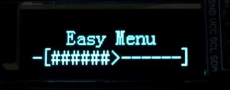

# 更新记录

* **2026.3.6-V3.2.2**：修复配置器在生成代码时会将变量变成小写，以及格式构建错误的问题。

* **2026.3.3-V3.2.1**：修复配置器在生成初始化代码时，会将条目变量名和数据变量名混用的问题。

* **2026.3.1-V3.2.0**：1、为条目增加了一个`变量名`属性，用户可以自定义条目的变量名，当变量名重复时，可以勾选 `以父级作为前缀` 防止变量名重复。2、改进了代码的增量更新功能，即使变量名发生改变，回调函数的内容仍然会继承到新的回调函数中。3、优化生成代码的样式，将原先的用 `_` 连接改为 `__` ，以便区分所属页面。

* **2026.2.11-V3.1.0**：优化菜单配置器的显示样式，会根据系统主题自动切换浅色或深色主题，修复了配置器在深色主题下显示异常的问题。


* **2026.1.22-V3.0.0:** 将原先沿用参考项目的底层全部推翻重写，整个架构都完全不同，参考了动画菜单框架中的一些思路，极大提高了性能，优化了使用体验，并且增加了更多功能。例：展示条目、中文支持、反色显示、类 STM32CubeMX 的增量更新功能等。

* **2025.9.19-V2.0.0：** 将整个系统重构为完全静态的实现，降低资源占用，并且没有改变最上层的调用，所以使用方式和上个版本完全相同，同时解决了已知 Bug。（发现多了很多其他 Bug，目前还是推荐使用 V1.0.0 版本，注意非浮点数要删除末尾的 f 即可）

# 项目说明

* 本项目包含了两个部分，菜单系统的底层框架和配套的可视化配置器。
* 视频介绍与移植教程：[点击此处跳转](https://www.bilibili.com/video/BV1XyzNBNEBQ/?vd_source=5ccd64d3c4d113ad5f6b8b690789ec0f)
* 编译环境：需要保证编译器支持 C99 。（Keil MDK……）



## 快速开始

1. 下载界面右侧发行版中的 **Easy_Menu v3.1.0.zip** 并解压。
2. 将 **Menu_Core** 中的所有文件(除了`.json`)都添加进工程中。
3. 根据屏幕和字符大小修改 `Easy_Menu.h` 中的宏定义配置

```C
#define SCREEN_WIDE     128            // 屏幕宽（像素）
#define SCREEN_HIGHT    32             // 屏幕高（像素）

#define CHAR_WIDE       8              // 字符宽（像素），统一使用 ASCII 字符的宽度，中文字符必须为 ASCII 字符的两倍
#define CHAR_HIGHT      16             // 字符高（像素）
```

4. 根据以下函数原型**实现字符显示函数**（二选一），自行测试函数功能，确保显示正常:

```C
/**
    * @brief  字符显示函数
    * @param  x: 起点 X 轴坐标
    * @param  y: 起点 Y 轴坐标
    * @param  ch: 需要显示的目标字符
    * @param  reverse_flag: 反色显示标志位（不需要反色显示，可以忽视），0-正常，1-反色
  */
void (*Display_Char)(unsigned short int x, unsigned short int y, char ch, unsigned char reverse_flag);
/**
    * @brief  字符显示函数（Y 轴以行为单位）
    * @param  x: 起点 X 轴坐标
    * @param  line: 对应行（对于不等分的行，可以自行用 switch 来设定每行对应的 Y 轴坐标）
    * @param  ch: 需要显示的目标字符
    * @param  reverse_flag: 反色显示标志位（不需要反色显示，可以忽视），0-正常，1-反色
  */
void (*Display_Char_Line)(unsigned short int x, unsigned char line, char ch, unsigned char reverse_flag);
```

5. 调用**菜单系统初始化函数**，绑定字符显示函数:

```C
#include "Easy_Menu.h"
/**
    * @brief  菜单系统初始化
    * @param  Display_Char: ASCII 字符显示函数
    * @param  Display_Char_Line: ASCII 字符显示函数（Y 轴以行为单位）
    * @param  Display_Chinese_Char: 中文 字符显示函数
    * @param  Display_Chinese_Char_Line: 中文字符显示函数（Y 轴以行为单位）
    * @notes  ASCII 相关的显示函数，至少绑定一个，系统才能显示，Chinese 相关的中文显示函数为可选项
  */
void Easy_Menu_Init(Display_Char, Display_Char_Line, NULL, NULL);
```

6. 在循环中调用**菜单系统显示函数**，并传入 Tick（如果不使用展示页面/条目可以直接给 0）:

```C
#include "Easy_Menu.h"

uint32_t menu_tick; // Tick 变量最好 1ms 自增一次
Easy_Menu_Display(menu_tick);
```
7. 编译下载，一气呵成。


### 基本使用流程

```c
// 1. 包含头文件
#include "Easy_Menu.h"

// 2.实现系统显示函数
void Menu_Display_Char(unsigned short int x, unsigned char line, char ch, unsigned char reverse_flag)
{
    …………
}

void main(void) {
    // 3. 菜单系统初始化，并绑定显示函数
    Easy_Menu_Init(NULL, Menu_Display_Char, NULL, NULL);
    
    while(1) {
        // 4. 处理按键输入
        Easy_Menu_Input_TYPE key = Get_Key_Input(); // 用户实现的按键获取函数
        Easy_Menu_Input(key);
        
        // 5. 在循环中调用菜单系统显示，并传入系统 tick（最好是 1ms 自增一次，如果不使用展示页面/条目可以直接给 0）
        static uint32_t tick = 0;
        Easy_Menu_Display(tick++);
        
        Delay_Ms(10); // 适当延时
    }
}
```
### 按键定义

```c
typedef enum {
    EASY_MENU_NONE,     // 无操作
    EASY_MENU_UP,       // 上
    EASY_MENU_DOWN,     // 下
    EASY_MENU_LEFT,     // 左（返回/解锁）
    EASY_MENU_RIGHT,    // 右（确定/锁定）
} Easy_Menu_Input_TYPE;

Easy_Menu_Input(EASY_MENU_UP); // 按键输入
```

# Easy Menu - 简单、易用的嵌入式菜单框架
## 项目概述

Easy Menu 基于用户提供的显示字符函数进行显示，所以理论上支持所有可以显示字符的设备，并且这种形式的移植流程方便快捷。

## 功能概述

整个系统分为：页面和条目。

* 页面：普通页面、展示页面
* 条目：文本条目、开关条目、数据条目、枚举条目、展示条目、跳转条目

### 普通页面

* 用于将条目构建成多级菜单，所有条目都必须挂载在普通条目下。

> 每次进入普通页面，都会自动执行一次，开关条目、数据条目、展示条目的回调函数，用于数据刷新。

### 展示页面

* 该页面是一个留给用户自由发挥的画布，用户可以在这个页面上自定义显示内容。

### 文本条目

* 显示一行文本，右键可以触发一次回调函数

### 开关条目

* 绑定一个开关量，用于显示开关量的状态，数据修改时触发一次回调函数。

### 数据条目

* 绑定一个变量，用于显示变量的值，数据修改时触发一次回调函数。

### 枚举条目

* 用于显示多种状态，状态修改时触发一次回调函数。

### 展示条目

* 周期刷新，以显示绑定的变量的数值，刷新前触发一次回调函数。

### 跳转条目

* 跳转到目标页面，以此构建各页面间的联系

## 系统操作

需要四种动作来实现对菜单系统的控制:

* 上（EASY_MENU_UP）：光标移动/数值增大
* 下（EASY_MENU_DOWN）：光标移动/数值减小
* 左（EASY_MENU_LEFT）：返回/解锁
* 右（EASY_MENU_RIGHT）：确定/锁定

> 在实际应用中，不一定必须要 4 个按键才能实现，只需要有这四个动作的触发即可。
> 例如有两个按键，单击是上下，长按是返回和确定，也可以正常实现功能。

## 用户配置项(在 `Easy_Menu.h` 中修改对应的宏定义)

| 配置项                  | 默认值 | 说明                                                         |
| ----------------------- | ------ | ------------------------------------------------------------ |
| `SCREEN_WIDE`           | 128    | 屏幕宽（像素）                                               |
| `SCREEN_HIGHT`          | 32     | 屏幕高（像素）                                               |
| `CHAR_WIDE`             | 8      | 字符宽（像素），统一使用 ASCII 字符的宽度，中文字符必须为 ASCII 字符的两倍 |
| `CHAR_HIGHT`            | 16     | 字符高（像素）                                               |
| `USER_FREE_CHAR`        | \'>\'  | 解锁状态下的 ASCII 指示符                                    |
| `USER_FIX_CHAR`         | \'&\'  | 锁定状态下的 ASCII 指示符                                    |
| `USER_LIST_ITEM_CHAR`   | \'+\'  | 二级菜单 ASCII 指示符                                        |
| `TITLE_DISPLAY`         | 0      | 是否开启居中显示页面标题（普通页面），最大行数 > 1 才会生效  |
| `USER_TITLE_LEFT_CHAR`  | \'<\'  | 标题左侧的 ASCII 指示符                                      |
| `USER_TITLE_RIGHT_CHAR` | \'>\'  | 标题右侧的 ASCII 指示符                                      |
| `SWITCH_ITEM_MODE`      | 1      | 开关条目显示模式：0->显示 0 / 1，1->显示 OFF / ON            |
| `ENUM_ITEM_MODE`        | 0      | 枚举条目操作模式：0-普通队列，1-循环队列（从第 0 个往上会回到结尾，从结尾往下会回到第 0 个） |
## 用户函数

```C
/**
    * @brief  菜单系统初始化
    * @param  Display_Char: ASCII 字符显示函数
    * @param  Display_Char_Line: ASCII 字符显示函数（Y 轴以行为单位）
    * @param  Display_Chinese_Char: 中文 字符显示函数
    * @param  Display_Chinese_Char_Line: 中文字符显示函数（Y 轴以行为单位）
    * @notes  Char 相关的显示函数，至少有一个绑定系统才能显示，Chinese 相关的中文显示函数为可选项
  */
void Easy_Menu_Init(void (*Display_Char)(unsigned short int x, unsigned short int y, char ch, unsigned char reverse_flag), void (*Display_Char_Line)(unsigned short int x, unsigned char line, char ch, unsigned char reverse_flag),
                    void (*Display_Chinese_Char)(unsigned short int x, unsigned short int y, char* ch, unsigned char reverse_flag), void (*Display_Chinese_Char_Line)(unsigned short int x, unsigned char line, char* ch, unsigned char reverse_flag));

/**
* @brief  菜单系统显示
    * @param  Easy_Menu_Tick: 系统运行的 Tick
    * @notes  最好使用 1ms 自增的的变量来作为系统的 Tick 这样可以保证周期页面/条目的周期单位为 ms
  */
void Easy_Menu_Display(unsigned int Easy_Menu_Tick);

/**
    * @brief  刷新当前页面的内容
    * @param  Display_Char: ASCII 字符显示函数
    * @notes  仅对普通页面有效，用于在回调函数中修改其他开关/数据条目的值时，调用这个函数可以立刻刷新
    *		  例如在文本条目的回调函数中将同页面下的数据条目数值归 0，时，可以调用这个函数提前更新数值。
  */
void Easy_Menu_Display_Refresh(void);

/**
    * @brief  菜单系统输入
    * @param  user_input: 操作输入
    * @notes  无操作、上、下、左、右
  */
void Easy_Menu_Input(Easy_Menu_Input_TYPE user_input);

/**
    * @brief  获取当前页面的显示名称
    * @param  str: 用于接收字符串的指针
  */
void Easy_Menu_Get_Current_Page_Text(char* str);

/**
    * @brief  跳转到目标页面
    * @param  target_page: 目标页面的变量 
    * @notes  使用时需要以这样的形式使用：PAGE(target_page)
  */
void Easy_Menu_Goto_Page(Page *target_page);
```


## 资源占用

| 场景                                         | 占用字节                 | 变化                     |
| -------------------------------------------- | ------------------------ | ------------------------ |
| 没有添加菜单框架                             | RAM:5.12KB, ROM:18.93KB  | 0                        |
| 添加了菜单框架，但是菜单配置为空             | RAM:5.21KB, ROM:22.69KB  | RAM:+0.09KB, ROM:+3.76KB |
| 使用了默认的菜单配置（11 个页面，37 个条目） | RAM:56.87KB, ROM:29.20KB | RAM:+1.66KB, ROM:+6.51KB |

# Easy Menu Builder - 可视化菜单配置器

## 项目概述

Easy Menu Builder 是为 Easy Menu 设计的菜单配置生成器。它提供了一个直观的图形界面，允许开发者轻松创建和配置复杂的菜单结构，并自动生成相应的C语言代码，并支持类 STM32CubeMX 的增量更新功能。

## 安装与运行

### 方法1：使用预编译的应用程序（推荐）

直接运行打包好的Windows应用程序，无需安装Python环境：

```bash
Easy_Menu_Builder.exe
```

### 方法2：从源代码运行

#### 环境要求

- Python 3.8或更高版本
- PyQt6
- Windows/Linux/macOS

#### 安装依赖

```bash
pip install PyQt6
```

#### 运行程序

```bash
cd Easy_Menu_Builder
python Easy_Menu_Builder.py
```

## 使用说明

### 1. 创建菜单结构

- 右键添加页面/条目
- 支持左键长按调整层级结构

### 2. 生成代码

- 根据编译器的编码格式，设置编码。
- 生成代码，会在目标目录下生成 `.json` 和 `.c` 文件。
  - `.json` 用于在配置器中导入菜单配置
  - `.c` 用于替换示例中的 `Easy_Menu_User.c`


> 如果显示名称中有中文，需要在设置中将编码修改成 GB2312，目前菜单系统只支持 GB2312 的中文显示

## 生成的代码结构

生成的代码包含以下部分：

- 占位变量：包含所有菜单项所需的变量。
- 页面、条目定义：定义所需的页面和条目  。
- 枚举列表：枚举条目所绑定的列表。
- 回调函数（条目）：条目的回调函数模板。
- 回调函数（页面）：页面的回调函数模板。
- 设置列表（普通页面）：普通页面绑定的条目列表。
- 系统初始化：将所需的页面和条目进行初始化，并设置初始页面。

# 常见问题

## 数据条目的内容为空白

* 检测是否是使用了 float 类型的数据/展示条目，需要开启 sprintf 的浮点数支持。

## 生成报错：maximum recursion depth exceeded while calling a Python object

* 请检查是否有变量名相同的页面/条目。

# 参考项目

[RealTaseny/Easy_Menu_builder: An open source sofaware base on Qt, which you can easily build your own C++-based static menu navigator.](https://github.com/RealTaseny/Easy_Menu_builder)

[WouoUI-PageVersion](https://github.com/Sheep118/WouoUI-PageVersion)


# 作者的话

* 如果觉得有帮助，请动动手指点一个 ⭐，非常感谢！
* 在使用过程中出现 BUG 或者觉得哪里的使用不够方便的话，欢迎提交 issue
* 致力于做最实用、最方便、最易用的菜单框架，感谢大家的支持！

